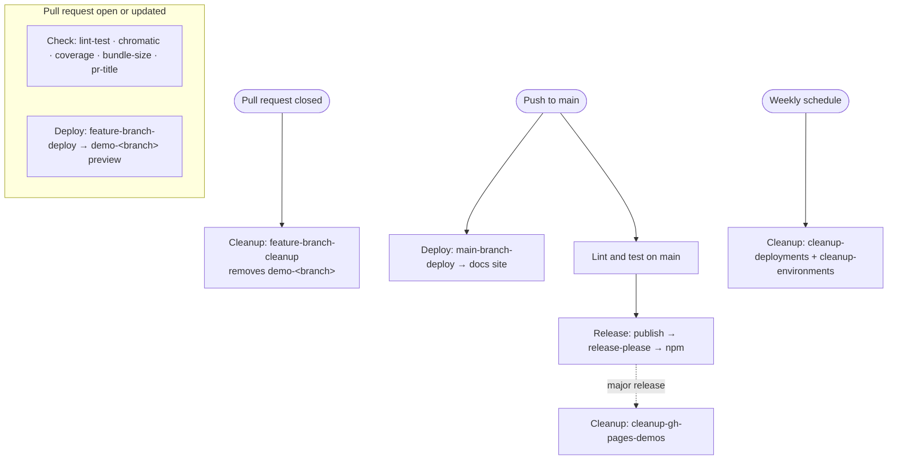

<!-- @license CC0-1.0 -->

# GitHub Actions workflows

This folder holds every continuous integration and delivery workflow for the design system.
There are twelve of them, but they only do four kinds of work.
Reading them by responsibility — rather than by file name — is the quickest way to understand the whole picture.

- **Check** — quality gates that run on every pull request.
- **Deploy** — build Storybook and publish it to GitHub Pages.
- **Release** — publish the packages to npm.
- **Cleanup** — remove preview deployments once a branch is gone.

Pull requests are made against `develop`, our integration branch.
Changes reach `main` through a release pull request, and that is what triggers the documentation deploy and the release.

## At a glance

| Workflow (file)                                               | Kind    | Runs when                                                      | Responsible for                                                                                                                    |
| :------------------------------------------------------------ | :------ | :------------------------------------------------------------- | :--------------------------------------------------------------------------------------------------------------------------------- |
| Lint and test (`lint-test.yml`)                               | Check   | Every pull request; push to `main`                             | Build all packages, then run the linters and unit tests. The main quality gate.                                                    |
| Test (`chromatic.yml`)                                        | Check   | Pull request opened or marked ready; `/chromatic test` comment | Visual regression snapshots through Chromatic.                                                                                     |
| Coverage report (`pr-coverage.yml`)                           | Check   | Every pull request                                             | Run the React tests with coverage and post a summary comment.                                                                      |
| Bundle size report (`pr-bundle-size.yml`)                     | Check   | Every pull request                                             | Report the compressed size change of the published bundles.                                                                        |
| PR title validation (`pr-title-validation.yml`)               | Check   | Pull request opened, edited, or synchronized                   | Enforce a Conventional Commit title (`feat`, `fix`, `chore`) so release-please can read it.                                        |
| Feature branch build and deploy (`feature-branch-deploy.yml`) | Deploy  | Push to any branch except `main`; pull request reopened        | Build Storybook and publish a per-branch preview to `gh-pages` under `demo-<branch>`. Records a GitHub Deployment and Environment. |
| Main branch build and deploy (`main-branch-deploy.yml`)       | Deploy  | Push to `main`                                                 | Build Storybook and publish the live documentation site to the `gh-pages` root.                                                    |
| Publish (`publish.yml`)                                       | Release | After “Lint and test” succeeds on `main`                       | Run release-please; if it cuts a release, build and publish the packages to npm.                                                   |
| Feature branch cleanup (`feature-branch-cleanup.yml`)         | Cleanup | Pull request closed (base is not `main`)                       | Delete that branch’s `demo-<branch>` directory and deactivate its Deployment.                                                      |
| Cleanup obsolete deployments (`cleanup-deployments.yml`)      | Cleanup | Weekly, Sunday 05:00 UTC; manual                               | Delete GitHub Deployment records for `demo-*` whose branch no longer exists.                                                       |
| Cleanup obsolete environments (`cleanup-environments.yml`)    | Cleanup | Weekly, Sunday 04:00 UTC; manual                               | Delete `demo-*` GitHub Environments whose branch no longer exists.                                                                 |
| Cleanup stale demo directories (`cleanup-gh-pages-demos.yml`) | Cleanup | After a major release; manual                                  | Remove stale `demo-*` directories from the `gh-pages` branch.                                                                      |

## How a change flows through them

### Opening or updating a pull request

The **Check** workflows run together and gate the merge.
Lint and test builds the packages and runs the linters and unit tests.
Chromatic takes visual snapshots, the coverage and bundle-size workflows post their reports as comments, and PR title validation checks the title.

At the same time, **Feature branch build and deploy** publishes a live Storybook preview for the branch at `demo-<branch>` on the Pages site.
This is why every push to a feature branch — or to `develop` — produces a `demo-*` preview.

### Merging to `main`

A push to `main` runs two things in parallel.
**Main branch build and deploy** rebuilds Storybook and replaces the live documentation site at the `gh-pages` root, keeping all `demo-*` previews untouched.
**Lint and test** runs again on `main`, and its success is the signal that starts **Publish**.

**Publish** runs release-please.
If there are releasable changes, release-please opens or updates a release pull request; merging that is what actually cuts the release.
When a release is cut, Publish builds the packages and pushes them to npm.

### Closing a pull request

**Feature branch cleanup** removes that branch’s `demo-<branch>` directory from `gh-pages` and deactivates its Deployment, so previews do not pile up.

### On a schedule or a release

The remaining three **Cleanup** workflows sweep up whatever the per-pull-request cleanup missed (see the next section).

## The demo preview ecosystem

A single feature-branch preview is not one object — it spans three separate GitHub surfaces, each created by **Feature branch build and deploy**:

1. a `demo-<branch>` **directory** on the `gh-pages` branch (the actual files),
2. a GitHub **Deployment** record (the entry in the Deployments timeline),
3. a GitHub **Environment** named `demo-<branch>` (the entry under Settings → Environments).

**Feature branch cleanup** handles the common case: when a pull request is closed it deletes the directory and deactivates the Deployment.
But branches can disappear without a clean pull-request close, and the Environment is never removed by that workflow, so orphans accumulate on all three surfaces over time.

That is why there are three scheduled or release-driven cleanups rather than one — each targets a different surface and needs a different mechanism:

| Workflow                       | Surface it cleans      | Mechanism        | Trigger               |
| :----------------------------- | :--------------------- | :--------------- | :-------------------- |
| Cleanup stale demo directories | `gh-pages` directories | Git, Bash script | Major release; manual |
| Cleanup obsolete deployments   | Deployment records     | REST API, Python | Weekly; manual        |
| Cleanup obsolete environments  | Environments           | REST API, Python | Weekly; manual        |

All three decide what is obsolete the same way: a `demo-X` item is stale when no remote branch matches `X` after stripping the leading `<prefix>/` segment — exactly the transformation **Feature branch build and deploy** uses when it creates the preview.
They default to a dry run and apply a grace window so an in-flight deploy is never raced into deletion.
The supporting scripts live in [`.github/scripts`](../scripts).

## Diagram

## Notes and gotchas

- **Publish depends on the name “Lint and test”.**
  `publish.yml` triggers on `workflow_run` for the workflow literally named `Lint and test`.
  If you rename that workflow, update the `workflows:` list in `publish.yml` in the same change, or releases stop running.
- **`workflow_run` runs on the default branch.**
  Publish always executes from `develop`, then checks out `main` itself; this is intentional and noted inline in the file.
- **Renaming a workflow can drop required status checks.**
  Branch protection refers to workflows and jobs by name, so renaming may silently un-require a check until it is re-selected in the repository settings.
- **Chromatic only snapshots the story named “Test”.**
  That is unrelated to this workflow’s display name also being “Test”; the two “Test” names are a coincidence worth disambiguating.
