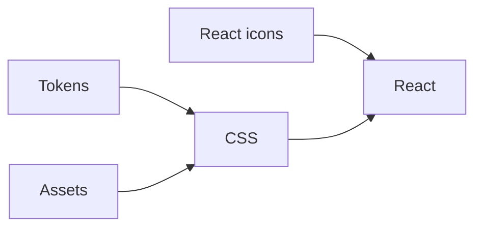

<!-- @license CC0-1.0 -->

# Publishing

We use a [Release Please GitHub Action](https://github.com/google-github-actions/release-please-action) to create changelog and release PRs for all our packages.
When the release PR is merged, that same action publishes the new release to npm, creates a release on GitHub, and deploys it to our main Storybook environment.

The [maintainers](./documentation/maintainers.md) can release new versions of our packages.
If you want to have rights to publish as well, contact one of the [maintainers](./maintainers.md).

## Conventional commits

To know whether a release is major, minor or patch and to generate changelogs automatically, we use the [conventional commits spec](https://www.conventionalcommits.org/en/v1.0.0/).
The titles of our PRs specify whether a change is:

- a `chore` which doesn’t trigger a release
- a `fix` resulting in a patch release,
- a new feature (`feat`), a minor release, or
- a breaking change (`feat!`), a major release.

Use the `chore` prefix when updating development dependencies, changing configuration or updating documentation that isn’t about a component.
Use the’ fix’ prefix for refactors, regular dependency updates or updates to documentation about components.

The PR title also describes the change in a clear, human-friendly way.
This PR title becomes the description of a commit when we squash merge a feature branch PR into `develop`.
These commit descriptions are eventually used to determine the release type and generate entries into our changelogs.

For example, a PR specifies that it’s introducing a breaking change and changes code in both the `css` and `react` packages.
This will cause a major version bump in both packages on release and add its description to the changelogs of both packages.

## How to create a release

1. Locally merge the latest version of `develop` into `main` using a fast-forward merge, and push to the remote:

   ```shell
     git checkout main
     git pull
     git merge --ff-only origin/develop
     git push
   ```

2. This triggers a GitHub Action, which creates a release PR.
   Review and approve this PR, then merge it – no need to wait for the checks.
   The same Action will then publish the release to npm and GitHub.
   It also deploys the released version to our main Storybook environment.
3. When complete, the Action adds a new release commit to `main`.
   Locally merge this commit back into `develop` and push it to the remote:

   ```shell
    git checkout develop
    git pull
    git merge --ff-only origin/main
    git push
   ```

### Gotchas

Release Please uses labels to determine the status of a release.
A release PR gets the label `autorelease: pending` or `autorelease: triggered`.
When running the action again, the PR with those labels gets released, and the labels should be removed.
However, due to GitHub API failures, it’s possible that the label was not removed correctly upon a previous release and Release Please thinks that the previous release is still pending.
Release Please will not create a new release PR if it thinks there is a pending release.
To fix this, check whether any closed PRs still have the `autorelease: pending` or `autorelease: triggered` labels, and remove them.

[See the Release Please docs for more information](https://github.com/googleapis/release-please?tab=readme-ov-file#release-please-bot-does-not-create-a-release-pr-why).

## Dependencies between packages

We’ve defined (peer) dependencies between our packages, to simplify the installation process.
For example, our React package has a peer dependency on our CSS package.
When installing our React package, the correct version of our CSS package is automatically installed with it.

The dependency tree looks like this:



These dependencies mean we have to pay some extra attention when publishing.
Generally, the dependencies between our packages are defined using [PNPM’s `workspace:*` feature](https://pnpm.io/workspaces#publishing-workspace-packages).
This means that when publishing our upstream packages (CSS and React), the latest version of our downstream packages (tokens, assets, and React icons) are defined as dependencies.

This works, as long as the release at least includes new versions of both our CSS and React packages.
But say, we do a release which only includes a new version of our tokens and assets packages.
They get a new version, but our CSS and React packages don’t have any changes, which means they don’t get new versions.
This means the latest version of our CSS package has a peer dependency on an older version of our tokens package.

To fix this, we can manually add the latest version of our tokens package as a peer dependency of our CSS package.
In other words, we’d replace `"@amsterdam/design-system-tokens": "workspace:*"` with `"@amsterdam/design-system-tokens": "1.2.3"`.
After this, please don’t forget to run `pnpm i` to update the lockfile.
The changes to the `package.json` and the lockfile mean we can release a new version of our CSS package, which will contain the correct peer dependency.

Seeing as our CSS package is itself also a peer dependency of our React package, in the most extreme case we would have to do something like:

1. Release a new version of our tokens or assets packages only.
2. Manually change the peer dependency of our CSS package and release that.
3. Manually change the peer dependency of our React package and release that.

This probably won’t happen frequently, seeing as we usually modify both our CSS and React packages in between releases, but in the future it might.

Manually changing a peer dependency of an upstream package means it’s defined statically, not dynamically.
For the next release of our upstream package, we likely want to change it back to a dynamic definition (i.e. `workspace:*`).
Please remember to run `pnpm i` after doing this, to update the lockfile.
