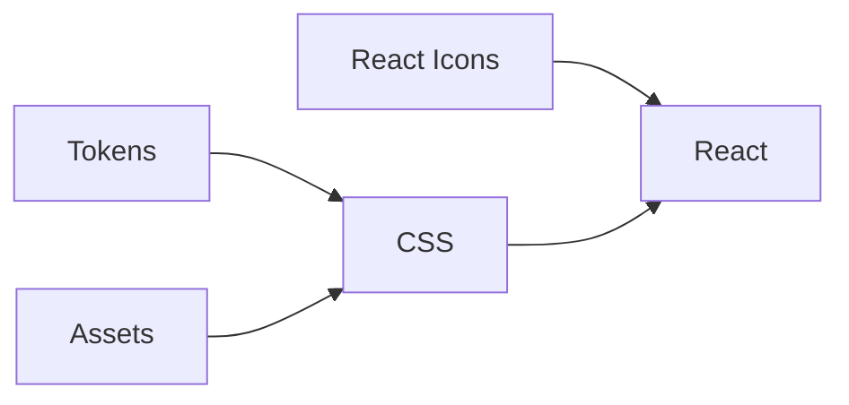

<!-- @license CC0-1.0 -->

# Publishing

We use a [Release Please GitHub Action](https://github.com/googleapis/release-please-action) to create changelog and release PRs for all our packages.
When the release PR is merged, that same action publishes the new release to npm, creates a release on GitHub, and deploys it to our main Storybook environment.

The [maintainers](./documentation/maintainers.md) can release new versions of our packages.
If you want to have rights to publish as well, contact one of the [maintainers](./maintainers.md).

## Conventional commits

To know whether a release is major, minor or patch and to generate changelogs automatically, we use the [conventional commits spec](https://www.conventionalcommits.org/en/v1.0.0/).
The titles of our PRs specify whether a change is:

- a `chore` which doesn’t trigger a release
- a `fix` resulting in a patch release,
- a new feature (`feat`), a minor release, or
- a breaking change (`feat!`), a major release.

Use the `chore` prefix when updating development dependencies, changing configuration or updating documentation that isn’t about a component.
Use the’ fix’ prefix for refactors, regular dependency updates or updates to documentation about components.

The PR title also describes the change in a clear, human-friendly way.
This PR title becomes the description of a commit when we squash merge a feature branch PR into `develop`.
These commit descriptions are eventually used to determine the release type and generate entries into our changelogs.

For example, a PR specifies that it’s introducing a breaking change and changes code in both the `css` and `react` packages.
This will cause a major version bump in both packages on release and add its description to the changelogs of both packages.

## How to create a release

1. Locally merge the latest version of `develop` into `main` using a fast-forward merge, and push to the remote:

   ```sh
     git checkout main
     git pull
     git merge --ff-only origin/develop
     git push
   ```

2. This triggers a GitHub Action, which creates a release PR.
   Review this PR and make sure to check the changelogs for the different packages.
   A commit might only be a breaking change for one package, but it will be marked as breaking for all affected packages

   Note: GitHub releases use the PR description to create the release notes.
   When you update a changelog, be sure to update both CHANGELOG.md and the PR description.

   Approve the PR, then merge it – no need to wait for the checks.

   The same Action will then publish the release to npm and GitHub.
   It also deploys the released version to our main Storybook environment.

3. When complete, the Action adds a new release commit to `main`.
   Locally merge this commit back into `develop` and push it to the remote:

   ```sh
    git checkout develop
    git pull
    git merge --ff-only origin/main
    git push
   ```

### Gotchas

Release Please uses labels to determine the status of a release.
A release PR gets the label `autorelease: pending` or `autorelease: triggered`.
When running the action again, the PR with those labels gets released, and the labels should be removed.
However, due to GitHub API failures, it’s possible that the label was not removed correctly upon a previous release and Release Please thinks that the previous release is still pending.
Release Please will not create a new release PR if it thinks there is a pending release.
To fix this, check whether any closed PRs still have the `autorelease: pending` or `autorelease: triggered` labels, and remove them.

[See the Release Please docs for more information](https://github.com/googleapis/release-please?tab=readme-ov-file#release-please-bot-does-not-create-a-release-pr-why).

## Dependencies between packages

We’ve established dependencies between our packages to avoid version mismatches.
For instance, our React package requires a specific version of our CSS package.

Here’s the dependency structure:



Managing these dependencies requires extra attention when publishing.
We use [PNPM’s workspace feature](https://pnpm.io/workspaces#publishing-workspace-packages) to define dependencies between our packages.
When we publish upstream packages like CSS and React, the latest specific versions of downstream packages (Tokens, Assets, and React Icons) get listed as dependencies.

This setup works well when we update both CSS and React in a release.
However, issues arise if a release only updates Tokens and Assets without changes to CSS or React.
The latest version of CSS then depends on an older version of Tokens.

To resolve this, we can manually let CSS depend on the latest version of Tokens.
We replace `"@amsterdam/design-system-tokens": "workspace:*"` with `"@amsterdam/design-system-tokens": "x.y.z"` and run `pnpm i` to update the lockfile.
We then release a new version of our CSS package, with the correct peer dependency.

After that, consider restoring the dynamic dependency (`workspace:*`) and updating the lockfile (`pnpm i`) accordingly.

The most extreme case requires us to release a new version of Tokens or Assets only, then update and release CSS, then update and release React.
Although infrequent, this scenario might occur in the future.
