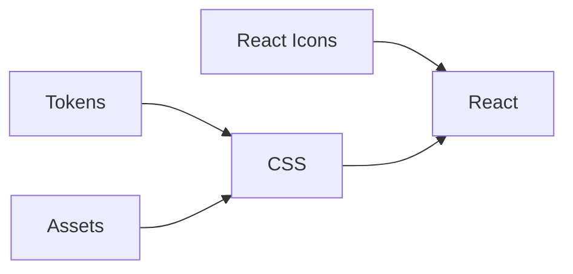

<!-- @license CC0-1.0 -->

# Publishing

We use a [Release Please GitHub Action](https://github.com/googleapis/release-please-action) to create changelogs and release PRs for all our packages.
When the release PR is merged, the Publish workflow (specifically the `pnpm -r publish` step in `.github/workflows/publish.yml`) publishes the new release to npm, after Release Please reports `releases_created == 'true'`. Release Please itself creates the release PR and the GitHub release, but does not publish to npm.
A separate “Main branch build and deploy” workflow keeps our main Storybook environment up to date with `main`.

The [maintainers](./maintainers.md) can release new versions of our packages.
If you want to have rights to publish as well, contact one of the maintainers.

The “Publish” workflow uses [npm trusted publishing](https://docs.npmjs.com/trusted-publishers) (OIDC), so individual maintainers don’t need personal npm credentials.

## Conventional commits

### Choosing a commit type

To know whether a release is major, minor or patch and to generate changelogs automatically, we use the [conventional commits spec](https://www.conventionalcommits.org/en/v1.0.0/).
The titles of our PRs specify whether a change is:

- a `chore` which doesn’t trigger a release
- a `fix` resulting in a patch release,
- a new feature (`feat`), a minor release, or
- a breaking change (append an `!`), a major release.

Use the `chore` type for changes with no consumer-visible impact: development dependencies, configuration, or documentation that isn’t about a component.
Use the `fix` type for changes that should reach consumers via a patch release: refactors, regular dependency updates, or updates to documentation about components.

The PR title also describes the change in a clear, human-friendly way.
This PR title becomes the description of a commit when we squash merge a feature branch PR into `develop`.
These commit descriptions are eventually used to determine the release type and generate entries into our changelogs.

For example, a PR specifies that it’s introducing a breaking change and changes code in both the `css` and `react` packages.
This will cause a major version bump in both packages on release and add its description to the changelogs of both packages.

### Adding a scope

If the change involves just one component, include its name in parentheses to show it as the scope of the PR, like this:

```text
fix(Avatar): Correct the aspect ratio for the image
```

The changelog for this PR will display the scope as a prefix, so it will read: “**Avatar**: Correct the aspect ratio for the image.”
There’s no need to repeat the component name in the rest of the PR title.
Changelog entries are sorted alphabetically, which helps group changes for the same component.

For changes that impact 2 to 5 components, separate their names with commas.
Other scopes, like `docs`, are allowed, as is omitting it.

## How to create a release

### Merge into the main branch

Locally merge the latest version of `develop` into `main` using a fast-forward merge, and push to the remote:

```sh
git checkout main
git pull
git merge --ff-only origin/develop
git push
```

**Optional**: To leave a reviewable record of each promotion, open a draft pull request from `develop` into `main` before the final `git push` to `main`.
This doesn’t interfere with the release PR that Release Please creates.
GitHub will mark the pull request as merged automatically when you push.

Pushing to `main` triggers the “Lint and test” workflow on GitHub. When this workflow completes successfully, it triggers the “Publish” workflow.
On this first run, Release Please opens (or updates) a release PR. The workflow runs again later, after that PR is merged, to create the GitHub release and publish to npm.

A separate “Main branch build and deploy” workflow runs in parallel and refreshes our main Storybook environment from the latest `main`.

### Review the release PR

Review the release PR created by Release Please.
Make sure to check the changelogs for the different packages.
A commit might only be a breaking change for one package, but it will be marked as breaking for all affected packages.

**Note**: Apply any updates to the changelog to both `CHANGELOG.md` and the PR description.
Release Please uses the PR description to create the GitHub release notes.

**Note**: Make sure all necessary peer dependencies get updated.
Releases that only change Tokens or Assets may require extra steps for CSS or React.
See below for details.

### Approve and merge the release PR

Approve the release PR, then merge it – no need to wait for the checks, since the release PR only bumps versions and updates changelogs (no source code changes). The merge must be done manually; the workflow does not merge the PR automatically.

After merging, the “Publish” workflow runs again. Release Please now reports `releases_created == 'true'`, which gates the npm publish step, so the new versions are pushed to GitHub and npm.

### Merge back into develop

Merging the release PR adds the version bumps and changelog updates to `main` as a new commit, after which Release Please creates the corresponding GitHub release. Locally merge this commit back into `develop` and push it to the remote:

```sh
git checkout develop
git pull
git merge origin/main
git push
```

If `develop` has progressed since the merge to `main`, this will produce a merge commit.

If a [branch protection rule](https://docs.github.com/en/repositories/configuring-branches-and-merges-in-your-repository/managing-protected-branches/about-protected-branches) prevents you from pushing directly to `develop`, you won’t be able to complete the merge-back with a direct push.
If you have admin access, you can temporarily disable the rule, merge, and re-enable it.
Alternatively, create a pull request to merge `main` into `develop`.

### Gotchas

#### Don’t change the PR title

The Release Please Action generates a release PR with a specific title (currently: `chore: release main`).
On subsequent runs, the Action looks for an open PR with this exact title so it can update it instead of creating a duplicate.
Changing the title breaks that lookup and can cause the Action to fail or create a second release PR.

#### Remove stale release labels

Release Please uses labels to determine the status of a release.
A release PR gets the label `autorelease: pending` or `autorelease: triggered`.
When running the action again, the PR with those labels gets released, and the labels should be removed.

However, due to GitHub API failures, it’s possible that the label was not removed correctly upon a previous release and Release Please thinks that the previous release is still pending.
Release Please will not create a new release PR if it thinks there is a pending release.

To fix this, check whether any closed PRs still have the `autorelease: pending` or `autorelease: triggered` labels, and remove them.

[See the Release Please docs for more information](https://github.com/googleapis/release-please?tab=readme-ov-file#release-please-bot-does-not-create-a-release-pr-why).

## Dependencies between packages

We’ve established dependencies between our packages to avoid version mismatches.
For instance, our React package requires a specific version of our CSS package.

Here’s the dependency structure:


```mermaid
graph LR
  RI["React Icons"] --> React
  Tokens --> CSS
  Assets --> CSS
  CSS --> React
```

Managing these dependencies requires extra attention when publishing.
We use [PNPM’s workspace feature](https://pnpm.io/workspaces#publishing-workspace-packages) to define dependencies between our packages.
When we publish CSS and React, the latest specific versions of their dependencies get pinned: Tokens and Assets for CSS, and CSS and React Icons for React.

This setup works well when we update both CSS and React in a release.
However, issues arise if a release only updates Tokens and Assets without changes to CSS or React.
The latest version of CSS then depends on an older version of Tokens.

**Step-by-step example for dependency updates:**

1. Release a new version of Tokens or Assets only.
2. In the CSS package, update the dependency for Tokens or Assets from `"workspace:*"` to the new version number (e.g., `"x.y.z"`).
3. Run `pnpm i` to update the lockfile.
4. Release a new version of the CSS package, with the correct peer dependency.
5. (Optional) Restore the dynamic dependency (`workspace:*`) in the CSS package and run `pnpm i` again.
6. If needed, update and release React to depend on the new CSS version.

Although infrequent, this scenario might occur in the future.
